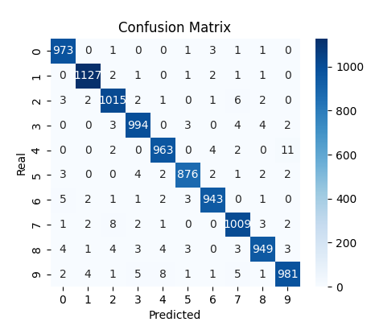

# Fundamentals of **Deep Machine Learning**.
The main goal of this project is to demonstrate my knowledge and understanding of key algorithms that are the basis of ready-made deep machine learning libraries, such as **TensorFlow** and **PyTorch**. I can also implement these algorithms from scratch, using only the most basic tools, such as **Numpy** in **Python**, for fast calculations. I believe that this knowledge facilitates the understanding of frequently occurring problems in this field and better hyperparameter tuning. All algorithms, functions, derivatives, and activations have been implemented from scratch.

## Implementation of Key Classes

### **Tensor**
I implemented the **Tensor** class, which extends the **ndarray** class from the Numpy library in Python. I modified the most important mathematical operations to store **intermediate gradients** during mathematical operations. Thanks to this, I could then calculate gradients for weights and bias for each of the layers during the execution of the **backpropagation** algorithm.

### **Fully-connected** Layer
Next, I implemented the **Fully-connected** layer, which has the previously implemented Tensor class as weights and bias. I also implemented methods to perform the **forwardpropagation** algorithm and the **Stochastic Gradient Descent** (**SGD**) algorithm.

### **GradientTape**
In addition, I created the **GradientTape** class, which creates a **context**. In this context, if I perform calculations on the Tensor, intermediate gradients are recorded. Outside this context, gradients are not recorded. The purpose of this procedure is to optimize the speed of the code and memory, as there is no point in calculating and storing intermediate gradients for calculations that are not part of the forwardpropagation algorithm.

## **Classifier**
Thanks to this, I was able to implement an image classifier, a training loop, and the necessary tools for model evaluation and result visualization. I used the **MNIST** dataset for this, which contains handwritten digits from 0 to 9 in grayscale of size 28x28 pixels, i.e., **784** values. Ultimately, the best results were obtained for a model with two layers with the following configuration:

   1. Input: 784 values, output: 392 values, activation: **sigmoid**.
   2. Input: 392 values, output: 10 values (because we have 10 digits), activation: sigmoid.

The classifier achieved over an excellent **98.3%** accuracy on the entire MNIST validation set, which contains over 10,000 test images. This means that out of 10,000 images, the model correctly classified over 9,830 images.

## **Generative Adversarial Network** (**GAN**)

I also implemented a **GAN**, which consists of two models: 
   - The **Generator**, whose task is to transform noise, a randomly generated number space called **latent space**, into the most realistic images possible.
   - The **Discriminator**, whose task is to classify images as real for images from the dataset (the model should predict a value of 1) and as fake for images generated by the generator (value 0).

Both of these models compete with each other. The generator tries to deceive the discriminator by generating increasingly credible images, and the discriminator becomes better and better at distinguishing between real and fake images.

### Architecture
To build the generator, I used 3 layers with the following configuration:
   1. input: 100 values (latent space), output: 200 values, activation: **tanh** (hyperbolic tangent),
   2. input: 200 values, output: 400 values, activation: tanh,
   3. input: 400 values, output: 784 values, activation: tanh.

The discriminator also consists of 3 layers:
   1. input: 784 values, output: 400 values, activation: **LeakyReLU**, 
   2. input: 400 values, output: 50 values, activation: LeakyReLU,
   3. input: 50 values, output: 1 neuron (image truthfulness rating), activation: sigmoid..

### GAN Training Visualization

## Encountered Problems
During the first network training, I encountered a problem with the training time. It turned out that using Numpy arrays and replacing values with my own **Variable** class slowed down the process because calculations were at the level of a single variable and not at the array level. The solution was to modify the array itself, adding attributes containing arrays for gradients. I also had to modify all the necessary mathematical functions performed at the array level, but the difference in speed and memory consumption was colossal.

The second problem was the phenomenon of **mode collapse** during GAN training. It occurs when the discriminator learns too quickly and punishes the generator too harshly. Instead of generating diverse images, the generator takes the easy way out and generates the simplest image to be rewarded, in this case, it increasingly generated ones. The solution was better hyperparameter tuning, such as network complexity or learning rate, not updating the discriminator’s weights every 3 iterations - which helped the generator catch up with the discriminator, and reducing the learning rate during training.

## Github Repository

[**Here**](https://github.com/JakubCzarnik/NumPy-MNIST-GAN-Classifier) is the full implementation of the described project.