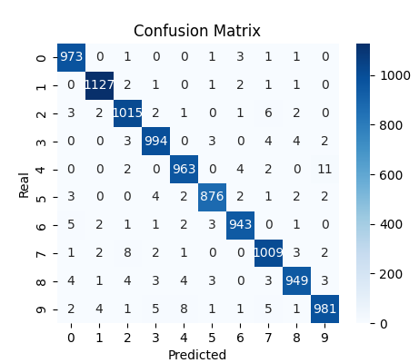

# Fundamenty **Deep Machine Learning**.

Głównym celem tego projektu jest demonstracja mojej znajomości i zrozumienia kluczowych algorytmów, które są podstawą gotowych bibliotek do głębokiego uczenia maszynowego, takich jak **TensorFlow** i **PyTorch**. Potrafię również implementować te algorytmy od podstaw, korzystając jedynie z najbardziej podstawowych narzędzi, takich jak **Numpy** w **Pythonie**, do szybkich obliczeń. Uważam, że ta wiedza ułatwia zrozumienie często pojawiających się problemów w tej dziedzinie oraz lepsze dopasowywanie hiperparametrów. Wszystkie algorytmy, funkcje, pochodne i aktywacje zostały zaimplementowane od zera.

## Implementacja kluczowych klas

### **Tensor**
Zaimplementowałem klasę **Tensor**, która rozszerza klasę **ndarray** z biblioteki Numpy w Pythonie. Zmodyfikowałem najważniejsze operacje matematyczne, aby podczas wykonywania operacji matematycznych przechowywać **gradienty pośrednie**. Dzięki temu mogłem następnie obliczyć gradienty dla wag oraz biasu dla każdej z warstw podczas wykonywania algorytmu **backpropagation**.

### Warstwa **Fully-connected**
Następnie zaimplementowałem warstwę **Fully-connected**, która jako wagi oraz bias posiada wcześniej zaimplementowaną klasę Tensor. Zaimplementowałem również metody do wykonania algorytmu **forwardpropagation** oraz algorytmu **Stochastic Gradient Descent** (**SGD**). 

### **GradientTape**
Dodatkowo, stworzyłem klasę **GradientTape**, która tworzy **kontekst**. W tym kontekście, jeżeli wykonam obliczenia na Tensorze, zapisują się gradienty pośrednie. Poza tym kontekstem, gradienty nie są zapisywane. Celem tego zabiegu jest optymalizacja szybkości kodu oraz pamięci, ponieważ nie ma sensu obliczać i przechowywać gradientów pośrednich, dla obliczeń które nie są częścią algorytmu forwardpropagation.

## **Klasyfikator**

Dzięki temu mogłem zaimplementować klasyfikator obrazów, pętlę treningową oraz potrzebne narzędzia do ewaluacji modelu oraz wizualizacji wyników. Wykorzystałem do tego zestaw danych **MNIST**, który zawiera ręcznie pisane cyfry od 0 do 9 w odcieniach szarości o rozmiarze 28x28 pikseli czyli **784** wartości. Końcowo, najlepsze rezultaty uzyskałem dla modelu z dwiema warstwami o następującej konfiguracji: 
   
   1. Wejście: 784 wartości, wyjście: 392 wartości, aktywacja: **sigmoid**.
   2. Wejście: 392 wartości, wyjście: 10 wartości (ponieważ mamy 10 cyfr), aktywacja: sigmoid.

Klasyfikator osiągnął ponad znakomite **98.3%** dokładności na całym zbiorze walidacyjnym MNIST, który zawiera ponad 10 000 obrazów testowych. Oznacza to, że na 10 000 obrazów, model sklasyfikował poprawnie ponad 9 830 obrazów.

## **Generative Adversarial Network** (**GAN**)

Zaimplementowałem również **GAN**, który składa się z dwóch modeli: 
   - **Generatora**, którego zadaniem jest przekształcenie szumu, losowo wygenerowanej przestrzeni liczb zwanej **przestrzenią latentną**, 
   na jak najbardziej realistyczne obrazy.
   - **Dyskriminatora**, którego zadaniem jest klasyfikowanie zdjęć, jako prawdziwe dla obrazów z datasetu (model powinien przewidywać wartość 1) oraz jako fałszywe dla obrazów wygenerowanych przez generator (wartość 0). 

Oba te modele ze sobą konkurują. Generator stara się oszukać dyskriminatora, generując coraz bardziej wiarygodne obrazy, a dyskriminator staje się coraz lepszy w odróżnianiu prawdziwych i fałszywych obrazów.

### Architektura
Do zbudowania generatora wykorzystałem 3 warstwy o następującej konfiguracji: 
   1. wejście: 100 wartości (przestrzeń latentna), wyjście: 200 wartości, aktywacja: **tanh** (tangens hiperboliczny), 
   2. wejście: 200 wartości, wyjście: 400 wartości, aktywacja: tanh, 
   3. wejście: 400 wartości, wyjście: 784 wartości, aktywacja: tanh.

Dyskriminator składa się również z 3 warstw: 
   1. wejście: 784 wartości, wyjście: 400 wartości, aktywacja: **LeakyReLU**, 
   2. wejście: 400 wartości, wyjście: 50 wartości, aktywacja: LeakyReLU, 
   3. wejście: 50 wartości, wyjście: 1 neuron (ocena prawdziwości obrazu), aktywacja: sigmoid.

### Wizualizacja treningu GAN

## Napotkane Problemy

Podczas pierwszego treningu sieci napotkałem problem z czasem treningu. Okazało się, że korzystanie z tablic Numpy i podmienianie wartości na moją własną klasę **Variable** spowalniało proces, ponieważ obliczenia były na poziomie pojedyńczej zmiennej a nie na poziomie tablicy. Rozwiązaniem okazało się zmodyfikowanie samej tablicy, dodając do niej atrybuty zawierające tablice dla gradientów. Musiałem również zmodyfikować wszystkie potrzebne funkcje matematyczne wykonywane na poziomie tablicy, ale różnica w szybkości i poborem pamięci była kolosalna.

Drugim problemem było zjawisko **mode collapse** podczas treningu GAN. Występuje ono, gdy dyskriminator zbyt szybko się uczy i zbyt mocno karze generator. Generator zamiast generować różnorodne obrazy, idzie na łatwiznę i generuje najprostszy obraz, aby być nagradzanym, w tym przypadku coraz częściej generował jedynki. Rozwiązaniem było lepsze dopasowanie hiperparametrów, takich jak złożoność sieci czy learning rate, nieaktualizowanie wag dyskryminatora co 3 iteracje - co pomagało generatorowi nadgonić dyskryminator oraz zmniejszenie learning rate w trakcie treningu.

## Repozutorium Github 

[**Tutaj**](https://github.com/JakubCzarnik/NumPy-MNIST-GAN-Classifier) znajduję się pełna implementacja opisywanego projektu.