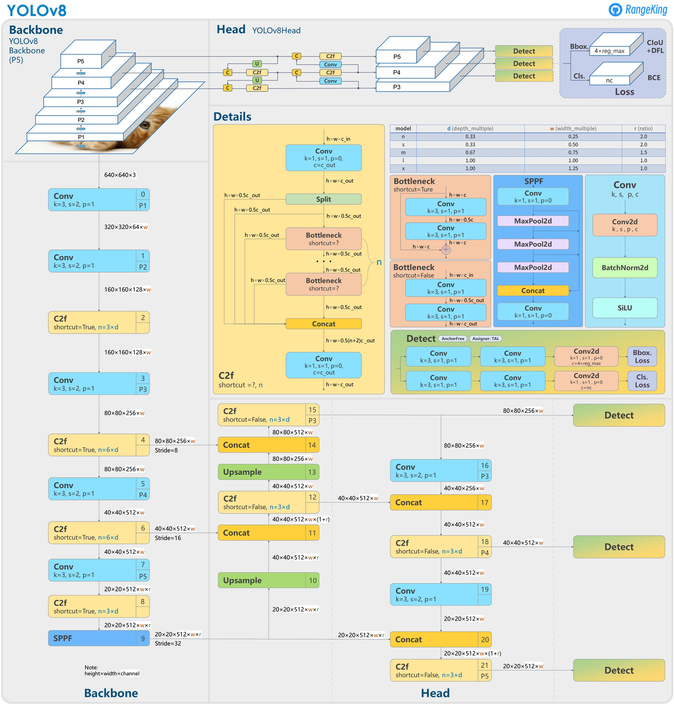

# **Object Detection using TensorFlow**

The aim of this project was to gain a better understanding of **Computer Vision**, develop skills in working with larger data sets, creating complex blocks and models, understanding key algorithms, and deepening general knowledge in the field of deep machine learning. The entire project was done in Python. I independently solved encountered problems and applied various techniques and approaches to achieve the best results.

## Model Architecture
During the implementation of the model, I followed the architecture of models used in the latest **YOLOv8** models. I implemented blocks: **Spatial Pyramid Pooling Fusion** (**SPPF**), **Bottleneck**, **C2f**, which I used to implement the **backbone** of the model, i.e., the part responsible for feature extraction. Additionally, the model at the output has a **Detect** block, which parallelly divides information into three smaller groups (for object certainty, for location and size of the bounding box (**bbox**), and object classification). Thanks to this technique, we significantly reduce the number of model parameters, and the model can focus more on individual problems. After the Detect block, I used the **DenormalizeBboxes** block, which is responsible for denormalizing all values related to the location and size of the bbox so that they are relative to the origin of the coordinate system.

I achieved the best results using two maps of different resolution instead of three:
   1. Marked as **p4**, it is 1/16 the size of the image (2<sup>4</sup> times lower resolution),
   2. Marked as **p5**, it is 1/32 the size of the image (2<sup>5</sup> times lower resolution).
So the model for an input of size 640x640 predicts a total of 2000 bboxes:
   - The p4 map has 1600 bboxes (640/16=40, 40<sup>2</sup>=1600) and its task should be to detect smaller objects,
   - The p5 map has 400 bboxes (640/32=20, 20<sup>2</sup>=400) and its task should be to detect larger objects.

Thanks to the use of these maps, the model directly predicts the position and size of the bbox, instead of the approach using **anchors**, where the model selected one of the previously determined anchors, for which it predicted how many times it needs to reduce or increase its size. This approach is called **Anchor-Free** and is used in the latest YOLOv8 models.

My model is consistent with the architecture of YOLOv8 shown below up to the Detect blocks.


## Data Loading and Processing
To load the data needed for training, I created the **DataGenerator** and **MetaData** classes, which load data from the **COCO2017** dataset that has over 100,000 different images. I use the powerful [**Albumentations**](https://albumentations.ai/) library for data augmentation, which also optimizes code speed. The MetaData class is responsible for processing data and creating a **label** for a single image, and the DataGenerator is responsible for loading data from a folder and then processing them using MetaData and packing them into a **batch** of a specified size.


## Loss Function
I also implemented a very complex loss function, which first uses the **DynamicBBoxMatcher** class responsible for dynamically best matching real bboxes to those predicted by the model, using the [**Hungarian algorithm**](https://en.wikipedia.org/wiki/Hungarian_algorithm), based on Intersection Over Union (**IOU**) and classification. This not only significantly speeds up the training process, but also allows the model to achieve better results.

The loss function consists of 3 components:
   1. Bbox certainty loss: for all predicted 2000 bboxes, where there should not be a bbox, a value of 0 is required, and where there should be a bbox, a value of 1 is required, using the **Binary Crossentropy** function.
   2. Bbox location and size loss only where there should actually be a bbox, I used a penalty that forces the model to maximize IOU between true and predicted values, i.e., the arithmetic mean of (1 - IOU).
   3. Classification loss also only where there should actually be a bbox, which uses **Categorical Crossentropy** loss.


Each of these components is multiplied by fixed weights (**hyperparameters**), so that the model can focus appropriately on each component.

## Model Optimization and Evaluation
Additionally, I used the Non-Maximum Suppression (**NMS**) algorithm, which is responsible for selecting the most certain bbox, which have a high IOU value with each other, in other words, this algorithm throws out bboxes that are very similar to each other. This also greatly increased the efficiency of the model, and I used it during model evaluation using these two metrics:

   1. **IouMetric**: This metric calculates the average IOU value, (i.e., the ratio of the intersection area to the sum area of two bboxes) for all pairs of bboxes. The model achieved 20% in this metric.
   
   2. **F1Score**: This metric is used to evaluate the model based on:
      - **True Positive** cases, when the model correctly identified an object. They occur when: ```(confidence_t > 0.5 AND confidence_p > 0.5) AND IoU >= threshold AND class_t == class_p``` 
      - **False Positive** cases, when the model incorrectly identified an object. They occur when:  ```(confidence_t < 0.5  AND confidence_p > 0.5)```
      - **False Negative** cases, when the model did not identify an object that it should identify. They occur when: ```(confidence_t > 0.5  AND confidence_p < 0.5) OR ((confidence_t > 0.5  AND confidence_p > 0.5) AND (IoU < threshold OR class_t != class_p))```
      
      where  ```confidence``` is the certainty of the bbox,  ```class``` is the class of the bbox, and **t** (true) corresponds to the true bbox, **p** (pred) - predicted,  ```threshold```  is the set threshold (in this case 60%). The model achieved **36%** for this metric.

## Training Tools
During the training of the model, it is important to track its progress and understand whether it is learning in the right way. For this purpose, I created a special **callback** function, which I called **MapsCompareCallback**.

**MapsCompareCallback** works as follows: After each epoch (iteration) of training, the function saves three different images. Each of these images contains a selected number of thumbnails of images from the dataset (in my case, I chose a 2x2 layout), and each of them displays bboxes. These images are saved to a specific folder:

   - Image with bboxes predicted by the model before applying the NMS algorithm. This image shows which bboxes the model initially considered to be the most probable.
   - Image with bboxes predicted by the model after applying the NMS algorithm. This image shows which of the initially predicted bboxes the model ultimately considered to be the most certain after applying the NMS algorithm.
   - Image with real bboxes straight from the dataset, serving as a reference point. This image shows what bboxes are actually true for a given image.

Thanks to this, I was able to easily notice any errors and better understand how to adjust the hyperparameters of the model, which was crucial for this project.

## Visualization
Below is an animation presenting the results of my model on images from the COCO2017 validation set. In the animation, on the left side, the results of the model are shown before using the NMS algorithm, and on the right side - after its use. I hope this visualization will help to better understand the operation of this algorithm.


## Summary 
This project was the most time-consuming for me, mainly because I had to figure out everything on my own. I tried different approaches - at first, I used **transfer learning** from the **ResNet101** model, or the approach with predefined **anchors**.

Key moments were the application of the DynamicBBoxMatcher algorithm, which made the biggest difference in the results, and then the use of the complex architecture of the YOLOv8 model. Ultimately, I am proud of what I have created and the results I have achieved.


I encourage you to visit my [**GitHub profile**](https://github.com/JakubCzarnik/Object-Detection-Model-for-the-COCO2017-dataset), where the full implementation of the project is available.