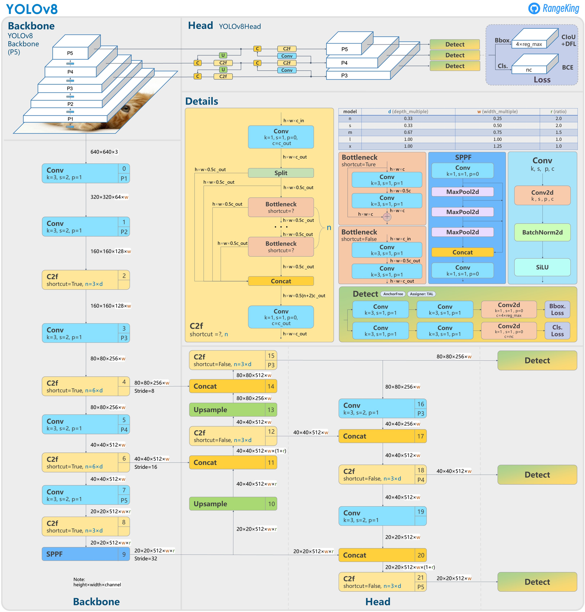
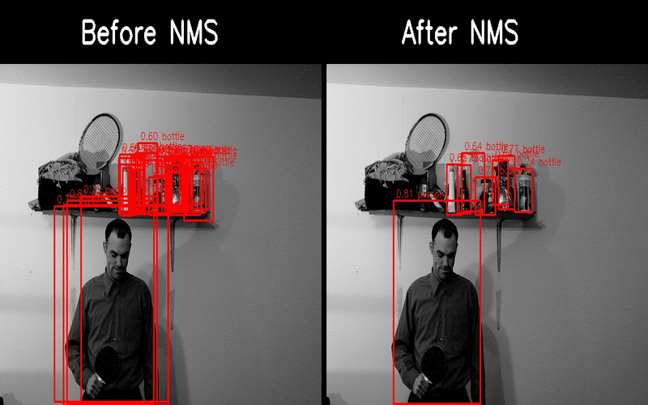

# **Detekcja obiektów przy użyciu TensorFlow**

Celem tego projektu było lepsze zrozumienie **Computer Vision**, rozwinięcie umiejętności pracy z większymi zestawami danych, tworzenia złożonych bloków i modeli, zrozumienie kluczowych algorytmów, a także pogłębienie ogólnej wiedzy w dziedzinie głębokiego uczenia maszynowego. Cały projekt został wykonany w Pythonie. Samodzielnie rozwiązywałem napotkane problemy i stosowałem różne techniki oraz podejścia, aby osiągnąć jak najlepsze rezultaty.

## Architektura modelu
Podczas implementacji modelu sugerowałem się architekturą modeli używanych w najnowocześniejszych modelach [**YOLOv8**](https://github.com/ultralytics/ultralytics). Zaimplementowałem bloki: **Spatial Pyramid Pooling Fusion** (**SPPF**), **Bottleneck**, **C2f**, których wykorzystałem do implementacji **backbone** modelu, czyli części odpowiedzialnej za ekstrakcje cech. Dodatkowo, model na wyjściu posiada blok **Detect**, który równolegle rozdziela informacje na trzy mniejsze grupy (dla pewności obiektu, dla położenia i rozmiaru bounding box’a (**bbox**) oraz klasyfikacji obiektu). Dzięki tej technice znacznie zmniejszamy ilość parametrów modelu oraz model może bardziej skupić się na poszczególnych problemach. Po bloku Detect wykorzystałem blok **DenormalizeBboxes**, którego zadaniem jest zdenormalizowanie wszystkich wartości dotyczących położenia i wielkości bbox'ów tak, aby były one względem początku układu współrzędnych.

Uzyskałem najlepsze wyniki, korzystając z dwóch map o różnej rozdzielczości zamiast trzech: 
   1. Oznaczona jako **p4**, ma wielkość 1/16 rozmiaru obrazu (2<sup>4</sup> razy mniejsza rozdzielczość), 
   2. Oznaczona jako **p5**, ma wielkość 1/32 rozmiaru obrazu (2<sup>5</sup> razy mniejsza rozdzielczość).

Zatem model dla wejścia o rozmiarze 640x640 przewiduje łącznie 2000 bbox'ów:
 - Mapa p4 posiada 1600 bbox'ów (640/16=40, 40<sup>2</sup>=1600) i jej zadaniem powinno być wykrywanie mniejszych obiektów, 
 - Mapa p5 posiada 400 bbox'ów (640/32=20, 20<sup>2</sup>=400) i jej zadaniem powinno być wykrywanie większych obiektów.

Dzięki wykorzystaniu tych map, model przewiduje wprost położenie i rozmiar bbox'a, zamiast podejścia z wykorzystaniem kotwic (tzw. **anchor**), gdzie model wybierał jedną z wcześniej wyznaczonych kotwic, dla której przewidywał o ile razy musi zmniejszyć bądz powiększyć jej rozmiar. To podejście nazywa się **Anchor-Free** i jest wykorzystywane w najnowszych modelach YOLOv8.

Mój model jest zgodny z podaną niżej architekturą YOLOv8 aż do bloków Detect.



## Wczytywanie i Przetwarzanie Danych
Do wczytywania danych potrzebnych do treningu, stworzyłem klasę **DataGenerator** oraz **MetaData**, które wczytują dane z datasetu [**COCO2017**](https://cocodataset.org/#home) który posiada ponad 100 000 różnych obrazów. Wykorzystuję potężną bibliotekę [**Albumentations**](https://albumentations.ai/) do augmentacji danych, która również optymalizuje szybkość kodu. Klasa MetaData odpowiada za przetwarzanie danych i tworzenie **etykiety** dla pojedynczego obrazu, a DataGenerator odpowiada za wczytywanie danych z folderu oraz następnym przetworzeniu ich przy użyciu MetaData i pakowaniu ich w **batch** o określonym rozmiarze.


## Funkcja Straty
Zaimplementowałem również bardzo złożoną funkcję straty, która najpierw wykorzystuje klasę **DynamicBBoxMatcher** odpowiadającą za dynamiczne najlepsze dopasowanie prawdziwych bbox'ów do tych przewidzianych przez model, korzystając z [**algorytmu węgierskiego**](https://en.wikipedia.org/wiki/Hungarian_algorithm), bazując na [**Intersection Over Union**](https://en.wikipedia.org/wiki/Jaccard_index) (**IOU**) oraz klasyfikacji. To nie tylko przyśpiesza znacznie proces treningu, ale dzięki temu model osiąga lepsze wyniki.


Funkcja lossu składa się z 3 składników:
   1. Loss pewności bbox’a: dla wszystkich przewidzianych 2000 bbox'ów, gdzie nie  powinno być bboxa, wymaga się wartości 0, a gdzie powinien być wymaga się wartości 1, wykorzystując funkcję **Binary Crossentropy** . 
   2. Loss położenia i wielkości bboxa tylko tam gdzie faktycznie powinien być bbox, wykorzystałem karę która zmusza model do maksymalizacji IOU pomiędzy prawdziwymi a przewidzianymi wartościami, czyli średnią arytmetyczną z (1 - IOU).
   3. Loss klasyfikacji również tylko tam gdzie faktycznie powinien być bbox, który wykorzystuje funkcję **Categorical Crossentropy**. 

Każdy z tych składników jest przemnażany przez ustalone wagi (**hiperparametry**), tak aby model mógł skupić się odpowiednio na każdym z składników.

## Optymalizacja i Ewaluacja Modelu
Dodatkowo skorzystałem z algorytmu Non-Maximum Suppression (**NMS**), którego zadaniem jest wybranie najbardziej pewnego bboxa, które mają ze sobą wysoką wartość IOU, innymi słowy ten algorytm wyrzuca bboxy, które są do siebie bardzo podobne. To również zwiększyło bardzo wydajność modelu, oraz użyłem go podczas ewaluacji modelu korzystając z tych dwóch metryk:
   1. **IouMetric**: Ta metryka oblicza średnią wartość IOU, (czyli stosunek pola przecięcia do pola sumy dwóch bbox'ów) dla wszystkich par bbox'ów. Model uzyskał 20% w tej metryce.
   
   2. **F1Score**: Ta metryka jest używana do oceny modelu na podstawie:
      - **Prawdziwie pozytywne** (True Positive) przypadki, kiedy model prawidłowo zidentyfikował obiekt. Występują one, gdy: ```(confidence_t > 0.5 AND confidence_p > 0.5) AND IoU >= threshold AND class_t == class_p``` 
      - **Fałszywie pozytywne** (False Positive) przypadki, kiedy model błędnie zidentyfikował obiekt. Występują one, gdy: ```(confidence_t < 0.5  AND confidence_p > 0.5)```
      - **Fałszywie negatywne** (False Negative) przypadki, kiedy model nie zidentyfikował obiektu, który powinien zidentyfikować. Występują one, gdy: ```(confidence_t > 0.5  AND confidence_p < 0.5) OR ((confidence_t > 0.5  AND confidence_p > 0.5) AND (IoU < threshold OR class_t != class_p))```
      
      gdzie ```confidence``` to pewność bboxa, ```class``` to klasa bboxa, a **t** (true) odpowiada prawdziwemu bboxowi, **p** (pred) - przewidzianemu, ```threshold``` to ustalony próg (w tym przypadku 60%).
      Model dla tej metryki uzyskał **36%**.

## Narzędzia do treningu
W trakcie treningu modelu, istotne jest śledzenie jego postępów i zrozumienie, czy uczy się on w odpowiedni sposób. W tym celu stworzyłem specjalną funkcję zwrotną (**callback**), którą nazwałem **MapsCompareCallback**.

**MapsCompareCallback** działa w następujący sposób: Po każdej epoce (iteracji) treningu, funkcja zapisuje trzy różne obrazy. Każdy z tych obrazów zawiera wybraną ilość miniatur obrazów z datasetu (w moim przypadku wybrałem układ 2x2), a na każdym z nich są wyświetlane bboxy. Obrazy te są zapisywane do określonego folderu:
   - Obraz z bboxami przewidzianymi przez model przed zastosowaniem algorytmu NMS. Ten obraz pokazuje, jakie bboxy model początkowo uważał za najbardziej prawdopodobne.
   - Obraz z bboxami przewidzianymi przez model po zastosowaniu algorytmu NMS. Ten obraz pokazuje, które z początkowo przewidzianych bbox'ów model ostatecznie uznał za najbardziej pewne po zastosowaniu algorytmu NMS.
   - Obraz z prawdziwymi bboxami prosto z datasetu, służący jako punkt odniesienia. Ten obraz pokazuje, jakie bboxy są rzeczywiście prawdziwe dla danego obrazu.

Dzięki temu mogłem łatwo zauważyć ewentualne błędy i lepiej zrozumieć, jak dostosować hiperparametry modelu, co było kluczowe dla tego projektu. 

## Wizualizacja
Poniżej znajduje się animacja prezentująca wyniki mojego modelu na obrazach z zestawu walidacyjnego COCO2017. Na animacji, po lewej stronie, ukazane są wyniki modelu przed użyciem algorytmu NMS, a po prawej stronie - po jego użyciu. Mam nadzieję, że ta wizualizacja pomoże lepiej zrozumieć działanie tego algorytmu.


## Podsumowanie 
Ten projekt był dla mnie najbardziej czasochłonny, głównie dlatego, że musiałem samodzielnie dochodzić do wszystkiego. Próbowałem różnych podejść - na początku korzystałem z **transfer learningu** z modelu **ResNet101**, czy z podejścia z predefiniowanymi **anchorami**.

Kluczowymi momentami było zastosowanie algorytmu DynamicBBoxMatcher, który zrobił największą różnicę w wynikach, a następnie skorzystanie z złożonej architektury modelu YOLOv8. Ostatecznie jestem dumny z tego, co stworzyłem i z wyników, które udało mi się osiągnąć.


Zachęcam do odwiedzenia mojego [**profilu na GitHubie**](https://github.com/JakubCzarnik/Object-Detection-Model-for-the-COCO2017-dataset), gdzie znajduje się pełna implementacja projektu.